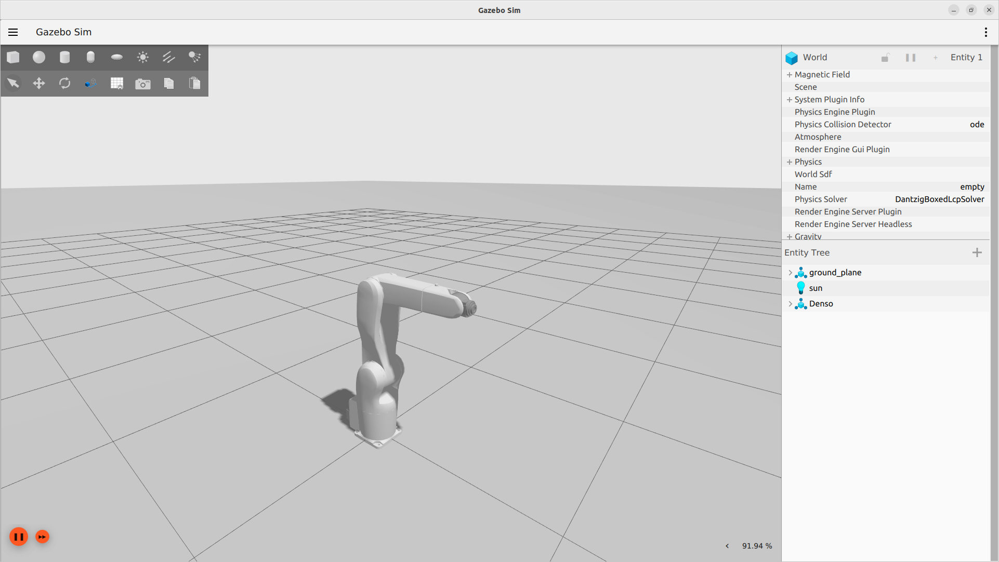

Please refer to https://wiki.ros.org/denso_robot_ros.

## Setup Environment

This branch is validated on the ROS humble version.

### Dependencies
`sudo apt install ros-humble-xacro`

## Real Robot
`ros2 launch denso_robot_bringup denso_robot_bringup.launch.py robot_ip:=192.168.0.1 robot_port:=5007`

## Simulation

If you want to use gazebo. You must install gazebo by manully source build method. 
### 1. Install Gazebo
Following as [Gazebo Official Install](https://gazebosim.org/docs/garden/install_ubuntu_src)

### 2. Install the Gazebo Ros2 Packages
Following as [Gazebo Ros2 ros package](https://github.com/gazebosim/ros_gz/tree/ros2#from-source)

Note: You should config your environment variable as `export GZ_VERSION=garden` before the colcon.

### 3. Install Gazebo Ros2 Control Plugin
Clone the [gz_ros2_control package](https://github.com/ros-controls/gz_ros2_control)

Check out to the `ahcorde/rename/ign_to_gz` branch.

This is because the version update of the Gazebo....

### 4. Source the Gazebo ws then export the Gazebo model environment variables
`export GZ_SIM_RESOURCE_PATH=/home/xx/xx_ws/install/denso_description/share/`

! Please replace the "xx" to your real path.

### 5. Launch the Gazebo Robot & Enjoy

`ros2 launch denso_robot_bringup denso_robot_bringup.launch.py sim_gazebo:=true robot_controller:=forward_position_controller`

> Option Luanch Moveit

`ros2 launch denso_robot_bringup denso_robot_bringup.launch.py sim_gazebo:=true robot_controller:=trajectory_controller`

`ros2 launch denso_robot_moveit_config denso_robot_moveit.launch.py use_sim_time:=true`

### 6. Control Robot
You can control the robot by publish the command to `/forward_position_controller/commands`

For example:

`ros2 topic pub --once /forward_position_controller/commands std_msgs/msg/Float64MultiArray "{layout: {}, data: [0,0,1.574,0,0,0]}"`

## Update Log

Rather than V3. This ROS2 version making the Denso robot SDK independentely, and you can use thses 3 packages(`bcap_core`, `bcap_service`, `denso_robot_core`) on any platform.